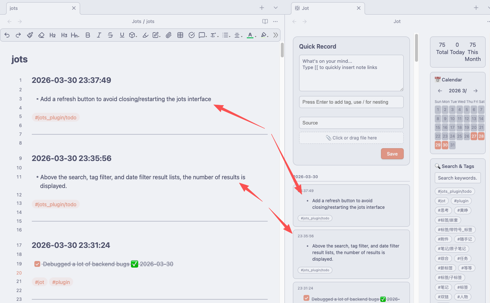

# MindDump

[English](README.md) | [中文文档](README-ZH.md)

[](https://github.com/kitsch-9527/obsidian-minddump-plugin/releases)
[](https://opensource.org/licenses/MIT)
[](https://obsidian.md)

MindDump is a quick note‑taking plugin for [Obsidian](https://obsidian.md). It helps you capture fleeting thoughts, jot down ideas, and manage fragmented notes with ease. Features like nested tags, file attachments, a calendar overview, full‑text search, and seamless Markdown rendering make it a perfect fit for your Obsidian workflow.

## Preview
### Workspace Area


### Sidebar


### MindDumps.md Note



## 1 ✨ Features

- **Quick Capture** – Open a dedicated modal with one click and start writing immediately.
- **Smart Tags** – Support nested tags (e.g. `Work/ProjectA`), with auto‑completion from existing tags.
- **Sources & Attachments** – Add source information and attach files (images, documents). Attachments are automatically named `minddump-YYYYMMDD-number`.
- **Calendar View** – Visualise daily note counts at a glance; click any date to filter entries.
- **Search & Filter** – Full‑text search, multi‑keyword AND queries, and tag‑based filtering.
- **Markdown Rendering** – Full support for Obsidian syntax: wikilinks, lists, checklists, blockquotes, embeds, and more.
- **Multi‑language** – Built‑in Chinese and English; follows Obsidian language settings or can be switched manually.
- **Flexible Storage** – Choose between “one file per day” or a single master file.
- **Zero interference** – MindDump creates .md files only in your chosen folder, leaves your other notes untouched. Uninstall anytime – your mind dumps remain intact.
- **Lightweight & Efficient** – Incremental loading and file caching for optimal performance.

## 2 📦 Installation

### 2.1 Install via BRAT (Recommended)

1. Install [BRAT](https://obsidian.md/plugins?id=obsidian42-brat) (Beta Reviewer’s Auto-update Tool) if you haven’t already.
2. Go to Settings → BRAT → Beta Plugin List → Add Beta Plugin.
3. Enter the GitHub repository URL of this plugin:  
    `https://github.com/kitsch-9527/obsidian-minddump-plugin`
4. Click “Add Plugin” and wait for the installation to complete.
5. Return to Community Plugins and enable `MindDump`.

### 2.2 Manual Installation
1. Download the latest `main.js`, `manifest.json`, and `styles.css` from the [Releases](https://github.com/kitsch-9527/obsidian-minddump-plugin/releases) page.
2. Create a folder `.obsidian/plugins/obsidian-minddump` in your vault.
3. Copy the three files into that folder.
4. Reload Obsidian and enable the plugin in the Community Plugins settings.

## 3 🚀 Usage

### 3.1 Opening the Capture Panel
- Click the ✨ icon in the left ribbon.
- Use the command palette: `MindDump: Quick Capture` / `MindDump: Open MindDump View`.
- Right‑click any text in an editor and choose “Save as MindDump”.

### 3.2 Quick Capture Modal
- **Content** – Write your thoughts; supports Markdown and Obsidian syntax.
- **Tags** – Enter a tag (e.g. `inspiration` or `Work/ProjectA`). Press `Enter` to add. Tags cannot contain spaces – use `/` for nesting.
- **Source** – Optional: record where the note came from (e.g., a URL, book title).
- **Attachments** – Click or drag a file to upload. Files are automatically named with date and sequence number; images show 🖼️, other files show 📎.
- **Save** – Click “Save” or press `Cmd/Ctrl + Enter` to save the note.

### 3.3 MindDump View
- **Calendar** – Displays the current month; days with notes are highlighted. Click any date to filter entries.
- **Search** – Type keywords (space‑separated for AND logic) to find matching notes.
- **Tag Filter** – Click any tag button to filter notes containing that tag.
- **Note Cards** – Each card shows the time, rendered Markdown content, tags, source, and attachments. Click a card to jump directly to the corresponding location in the source file.

## 4 ⚙️ Settings

| Option | Description |
|--------|-------------|
| Save Folder | Location where note files are stored (default: `MindDump`) |
| Attachments Folder | Where uploaded files are saved (default: `MindDump/attachments`) |
| Log Mode | `One file per day` or `Single file` |
| File Format | Filename pattern for multi‑file mode, e.g., `minddump-YYYYMMDD` |
| Use Fixed Tag | Automatically add a fixed tag to every note |
| Fixed Tag Value | The tag to add (without `#`) |
| Enable Frontmatter Tags | Write tags into YAML frontmatter in multi‑file mode (for Dataview etc.) |
| Language | Interface language (Chinese / English) |

## 5 🌍 Localisation

The plugin supports Chinese and English. It automatically follows Obsidian’s language setting, but you can also switch manually in the plugin settings. Contributions for other languages are welcome.

## 6 🛠 Development & Build

```bash
# Clone the repository
git clone https://github.com/kitsch-9527/obsidian-minddump-plugin.git
cd obsidian-minddump-plugin

# Install dependencies
npm install

# Development mode (auto‑rebuild on changes)
npm run dev

# Production build
npm run build
```

The built `main.js` and `styles.css` can be used directly in Obsidian.

## 7 📝 File Format

### 7.1 Multi‑File Mode
One file per day, named according to the configured format (e.g., `minddump-20260326.md`). Each note inside follows this structure:

```markdown
### YYYY-MM-DD HH:mm:ss

Note content

#tag1 #tag2/subtag

Source: Example source

![[attachment_path]] or [[attachment_path]]

---
```

### 7.2 Single File Mode
All notes are saved in a single `minddumps.md` file using the same format.

## 8 ❓ FAQ

**Q: Attachment upload fails or filenames conflict?**  
A: The plugin automatically generates unique filenames based on the date and sequence number and checks for existing files to avoid overwrites. If the problem persists, please check folder permissions or contact the developer.

**Q: What if I need spaces in a tag?**  
A: Tags cannot contain spaces. Use `/` to create nested tags (e.g., `Work/Important`).

**Q: How can I import existing notes into MindDump?**  
A: There is currently no direct import, but you can copy and paste the content into the Quick Capture modal.

**Q: The calendar doesn’t show all entries?**  
A: Ensure your note files are stored in the configured save folder. Try reloading the plugin or restarting Obsidian.

## 9 🤝 Contributing

Issues and pull requests are welcome! Before submitting a PR, please ensure:

- Code style is consistent with the existing codebase.
- New features are documented.
- Tests pass.

## 10 🙏 Acknowledgements

- This plugin is a fork of [obsidian-jot-plugin](https://github.com/ichris007/obsidian-jot-plugin) by [ichris007](https://github.com/ichris007), with significant enhancements and modifications. Many thanks to the original author for the inspiration and foundation.
- The UI design was inspired by the open‑source note‑taking tool [Memos](https://github.com/usememos/memos). My thanks as well.

## 11 📄 License

This project is released under the [MIT License](LICENSE).

---

**Enjoy dumping your thoughts!**
